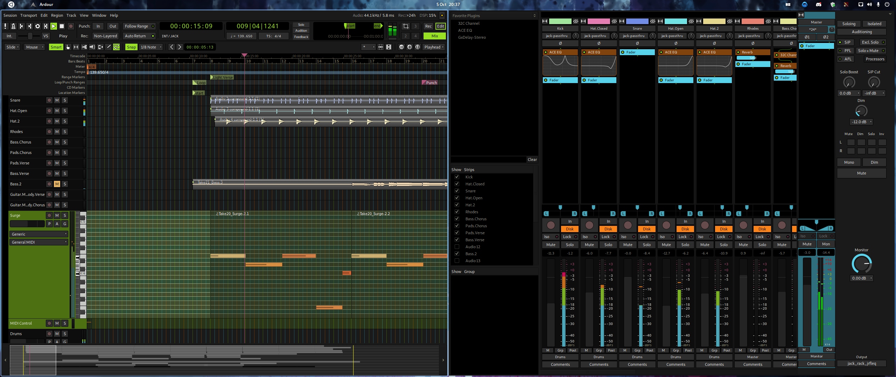

# Ardour Colour Themes

These themes are based on the [Monokai](https://monokai.pro) and [Soda](https://github.com/buymeasoda/soda-theme/) themes.

## Installation

Install the themes by running the install script!

```
$> sudo ./install.sh
```

Or if Ardour is installed somewhere else you'll have to find the `share/themes` directory 
and copy them into there.

That easy.

## Pics

### Monokai


### Monokai Soda



